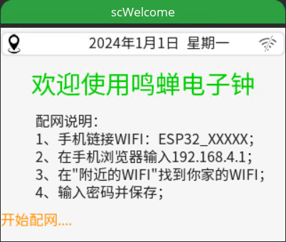
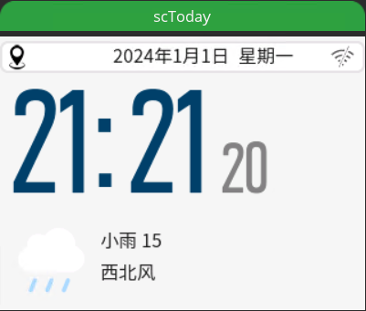
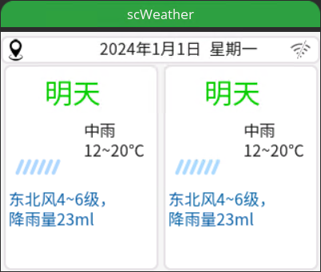

# esp32-ILI9431-XPT2046-Touch

#### 软硬介绍
 **   本程序是ESP32-S3+ILI9431(带xpt2046触摸)屏幕，**
- 硬件环境及驱动：
1. 选用esp32-s3-DevKitC-1  N16R8 开发板，配置开启PSRAM，16Mflash
2. 使用DS3231-RTC时钟模块（带温度）
3. 屏幕为ILI9431芯片。（dev分支为TFT_eSPI驱动，A-gfx分支为GFX驱动）
4. 屏幕带Touch的xpt2046芯片，采用XPT2046_Touchscreen驱动。
- 软件环境：
1. vscode + platformio  

#### 接线针脚定义
1. 屏幕  
#define DF_GFX_SCK 12  
#define DF_GFX_MOSI 11  
#define DF_GFX_MISO 13  
#define DF_GFX_CS 10  
#define DF_GFX_DC 14  
#define DF_GFX_RST -1  
#define DF_GFX_BL 7  
2. 触摸  
#define TOUCH_XPT2046_SCK 12  
#define TOUCH_XPT2046_MISO 13  
#define TOUCH_XPT2046_MOSI 11  
#define TOUCH_XPT2046_CS 17  
#define TOUCH_XPT2046_INT 18  
3. RTC  
SDA 8  
SCL 9  

#### 使用到的组件  
- UI界面： 
1. LVGL v8.3.11
2. LVGL界面UI使用SquareLine 1.4.0设计生成
3. 界面效果如下：  

  

  

  

#### 实际效果  
[电子时钟视频](https://t.bilibili.com/938091913412608036?share_source=pc_native)  

 - 引用的组件：
1. lvgl/lvgl@8.3.11
2. paulstoffregen/XPT2046_Touchscreen@1.4.0
3. bblanchon/ArduinoJson@6.21.5
4. moononournation/GFX Library for Arduino@^1.4.6 	

#### 注意事项  
1. 关于心知天所的私钥：
请在main.c文件第36行，修改成自己的心知天所私钥。

#### 更新说明  
2024-6-1  
1. 完成天气页面中明天、后天两天的天气显示。
2. 修改时间不准的bug。  
 
2024-5-31  
1.采用定时器，自动切换当天页面与其他天页面。
2.细分页面元素更新方法，以便在相对应时机调用更新。

2024-5-30  
1.将页面元素的显示更新与页面逻辑分离，分别放到ui_disp_update_imp模块和ui_action_imp模块  

2024-5-23
1. 完成触摸驱动，并且与屏幕共用SPI总线，以便节省针脚。  
2. 将获取心知天气的方法，由原来timer改为task，并按延时15分钟执行。解决切换到时钟页面时读秒卡2~3秒的问题。  
3. fix ntp时间的同步。

2024-5-22
1. 获取心知3天天气数据，并更新当天
2. 利用心知接口，实现定位。

2024-5-20
1. 通过网络获取时间，并校准RTC时钟  

2024-5-13
1.  A-gfx分支将作为主要开发分支持续开发
2.  增加DS3231-RTC时钟模块的读取 

